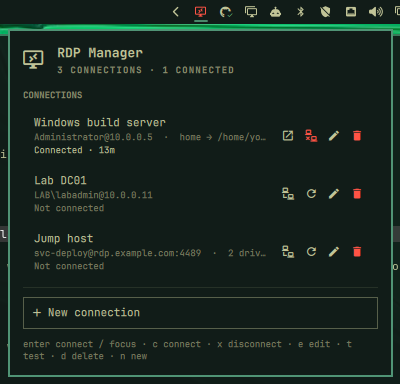

# RDP Manager for Omarchy

Saved RDP connections in the [Omarchy](https://omarchy.org) bar. Click the icon to
open a panel, connect with one keystroke, watch live session state — and keep
passwords in the system keyring instead of the process list.

Built for Omarchy 4 ("Quattro"), whose shell is a single long-running
[Quickshell](https://quickshell.org) instance with a real plugin system. Backed by
`xfreerdp3` (FreeRDP 3).



## Why

Driving `xfreerdp3` by hand means the host, the flags and the drive mappings live
only in shell history, and there is nothing on the desktop to tell you a session is
up. The obvious fix — putting `/p:yourpassword` in the command — is worse: FreeRDP
itself warns that *"passing credentials or secrets via command line might expose
these in the process list"*.

This plugin keeps the convenience and drops the exposure.

## Install

FreeRDP is not part of a stock Omarchy install, so install it first:

```bash
sudo pacman -S freerdp
```

Then add the plugin:

```bash
omarchy plugin add https://github.com/cahva/omarchy-rdp-manager.git --enable --yes
```

The other dependencies — `jq`, `gnome-keyring` and `libsecret` — are all in
`omarchy-base.packages`, so they are already there.

Check the pieces are in place:

```bash
xfreerdp3 --version
# `search` answers 0 even when nothing matches, so a clean exit means the
# keyring is reachable and unlocked. (Don't probe with `secret-tool --version`
# or `--help` — neither is a supported flag and both exit 2.)
secret-tool search --all service omarchy-rdp >/dev/null && echo "keyring ok"
```

To place or move the bar icon:

```bash
omarchy bar move io.github.cahva.rdp-manager --after omarchy.clock
```

## Remove

```bash
omarchy plugin remove io.github.cahva.rdp-manager
```

That takes the bar widget out of `shell.json` and deletes the plugin directory. It
deliberately leaves your data alone, so reinstalling picks up where you left off.
To remove that too:

```bash
# saved connections (contains no passwords)
rm -rf ~/.config/omarchy-rdp

# every password this plugin stored, in one call
secret-tool clear service omarchy-rdp
```

Two things the plugin does not own and does not clean up:

- `~/.config/freerdp/server/*.pem` — FreeRDP's own trust-on-first-use records,
  shared with any other FreeRDP client you run.
- `$XDG_RUNTIME_DIR/omarchy-rdp/` — per-session state, gone at your next reboot.

## How passwords are handled

The password never appears in `ps`, in the environment, or on disk in plaintext.

FreeRDP 3 supports `/args-from:fd:N`, which moves the **entire** argument list —
password included — onto a file descriptor. So the launcher does this:

```bash
xfreerdp3 /args-from:fd:3 3< <(printf '%s\n' "${args[@]}")
```

and `ps` shows only:

```
$ ps -eo args | grep freerdp
/usr/bin/xfreerdp3 /args-from:fd:3
```

The password's whole journey is: keyring → a shell variable in the launcher → an
anonymous pipe on fd 3 → FreeRDP. It is never an argv element, never written to a
file, and never put in the environment (`/args-from:env:` would have been readable
through `/proc/<pid>/environ`, which is why `fd:` is used instead).

Storage is `gnome-keyring` via `secret-tool`, under `service=omarchy-rdp` with the
connection id as the second attribute. Writes go over a pipe too — `secret-tool
store` reads the secret from stdin, so the panel never passes it as an argument.

You can manage secrets by hand:

```bash
# store (prompts, or pipe it in)
bin/omarchy-rdp-secret store my-server
# read back
bin/omarchy-rdp-secret lookup my-server
# forget
bin/omarchy-rdp-secret delete my-server
```

Deleting a connection in the panel removes its keyring entry too.

### What is *not* protected

The keyring is unlocked for the length of your desktop session, so anything running
as your user can read these passwords — same as your `gh` token or your SSH agent.
This raises the bar against `ps` snooping, shell history and backed-up dotfiles; it
is not a defence against code already running as you.

## Configuration

Connections live in `~/.config/omarchy-rdp/connections.json`, created on first run.
It is plain JSON on purpose: readable, diffable, and safe to hand-edit. **It never
contains a password** — only a `"secret": "keyring"` marker.

```json
{
  "version": 1,
  "connections": [
    {
      "id": "windows-build-server",
      "name": "Windows build server",
      "host": "10.0.0.5",
      "port": 3389,
      "user": "Administrator",
      "domain": "",
      "secret": "keyring",
      "drives": [
        { "name": "home", "path": "/home/you/projects/shared" }
      ],
      "options": {
        "dynamicResolution": true,
        "clipboard": true,
        "cert": "tofu"
      }
    }
  ]
}
```

Edits are picked up live — no reload needed. Notes:

- `id` is generated from the name and is then **immutable**: it is the keyring
  lookup key and the `/wm-class` suffix used to detect the session's window.
  Changing it by hand orphans the stored password.
- `port` and `domain` are honoured by the launcher but have no form field yet.
- `cert` is `tofu` (trust on first use), `ignore`, or `deny`. TOFU state is
  FreeRDP's own, in `~/.config/freerdp/server/`.

Widget preferences live on the widget's entry in `~/.config/omarchy/shell.json`:

```bash
omarchy bar set io.github.cahva.rdp-manager notifyOnDisconnect false
omarchy bar set io.github.cahva.rdp-manager hideWhenIdle true
```

| Setting | Default | Effect |
|---|---|---|
| `notifyOnDisconnect` | `true` | Notify when a session ends, not just when it fails |
| `hideWhenIdle` | `false` | Hide the bar icon unless a session is connecting or connected |

## Using it

Click the bar icon, or bind `omarchy-shell shell toggle io.github.cahva.rdp-manager`.

| State | Bar icon |
|---|---|
| Idle | Plain glyph (hidden entirely with `hideWhenIdle`) |
| Connecting | Pulsing |
| Connected | Highlighted, with a count when more than one session is live |
| Last attempt failed | Tinted urgent; the reason is in the tooltip |

In the panel:

| Key | Action |
|---|---|
| `j` / `k` | Move between connections |
| `Enter` | Connect — or focus the window if already connected |
| `c` / `x` | Connect / disconnect |
| `e` / `d` | Edit / delete |
| `t` | Test the connection without opening a window |
| `n` | New connection |
| `Esc` | Close the panel, or back out of the form |

**Test** runs FreeRDP with `+auth-only`, which authenticates and stops before
opening a window. It is only ever run when you ask for it: it touches the network,
and a stale stored password on a timer could contribute to an account lockout.

## Command line

The helpers are real CLI tools, not just plumbing for the widget — which is how you
debug a connection that misbehaves. They live in the installed plugin directory:

```bash
cd ~/.config/omarchy/plugins/io.github.cahva.rdp-manager

bin/omarchy-rdp-launch my-server              # connect
bin/omarchy-rdp-launch my-server --dry-run    # print the FreeRDP args, password redacted
bin/omarchy-rdp-launch my-server --test       # +auth-only probe; exit code is the answer
bin/omarchy-rdp-status                        # one JSON line describing every session
bin/omarchy-rdp-focus my-server               # focus the session window
bin/omarchy-rdp-disconnect my-server          # close a session
```

There is also an IPC surface:

```bash
omarchy-shell io.github.cahva.rdp-manager list
omarchy-shell io.github.cahva.rdp-manager status
omarchy-shell io.github.cahva.rdp-manager connect my-server
omarchy-shell io.github.cahva.rdp-manager disconnect my-server
```

## Hyprland window rules

Every session gets the window class `omarchy-rdp-<id>`, so you can rule on it:

```
# ~/.config/hypr/hyprland.conf
windowrulev2 = workspace 9,        class:^(omarchy-rdp-.*)$
windowrulev2 = idleinhibit always, class:^(omarchy-rdp-.*)$
```

That class is also how the plugin distinguishes *connecting* from *connected*:
FreeRDP maps no window until the connection actually succeeds, so window presence is
a far better signal than the process merely being alive. Focusing a session switches
to its workspace, so the class is all the plugin needs to find it again.

If you are on Hyprland older than 0.56, note that `hyprctl dispatch` gained a Lua
interface in 0.56 and `bin/omarchy-rdp-focus` prefers it, falling back to the
pre-0.56 dispatcher.

## Sessions outlive the shell

Sessions are started detached (`setsid`), so `omarchy-restart-shell` — and the
hot-reload that fires whenever a plugin file is saved — will not take your RDP
session down with it. State is tracked in `$XDG_RUNTIME_DIR/omarchy-rdp/`, which is
how a freshly started shell re-attaches to a session already running.

That directory must be owned by you and mode `0700`, and the helpers refuse it
otherwise — including if it is a symlink. `omarchy-rdp-disconnect` turns a pid read
out of a file there into a `SIGTERM`, so a directory anyone else can write to would
let them choose the target. There is deliberately no `/tmp` fallback.

## Troubleshooting

**"No password stored yet"** — open the connection's edit form and set one, or run
`bin/omarchy-rdp-secret store <id>`.

**"Cannot run …/bin/omarchy-rdp-status"** — the helpers lost their executable bit.
`chmod +x bin/*` in the plugin directory.

**A connection fails with a reason you want more detail on** — FreeRDP's stderr is
kept per session at `$XDG_RUNTIME_DIR/omarchy-rdp/<id>.log`.

**Exit codes.** FreeRDP encodes connection failures as `135 + low byte of
ERRCONNECT_*`, so `140` is host-not-found, `141` connect-failed, `144`
authentication-failed, `156` wrong-password. The panel decodes the common ones; the
full table is in `/usr/include/freerdp3/freerdp/error.h`.

**The keyring is locked** — every `secret-tool` call is wrapped in `timeout`, so a
locked keyring surfaces as an error rather than hanging the bar. Unlock it and retry.

## Development

```bash
git clone https://github.com/cahva/omarchy-rdp-manager.git
cd omarchy-rdp-manager

./dev-install.sh                 # rsync into ~/.config/omarchy/plugins/ + reload
omarchy plugin enable io.github.cahva.rdp-manager right

node tests/model.test.js         # pure logic
node tests/manifest.test.js      # manifest + repo hygiene
tests/launcher.test.sh           # launcher/Model.js argv parity
```

`Model.js` holds every pure function and is shared by `Service.qml`, `Panel.qml` and
the tests. `Service.qml` is loaded **once per shell session** and owns all state, the
poll timer and every file write. `Panel.qml` is built **once per monitor** and is a
view — putting state there gives a two-monitor user two of it.

Two things worth knowing if you hack on this:

- `omarchy-shell shell rescanPlugins` does **not** re-instantiate an already-loaded
  `keepLoaded` service, so QML changes need `omarchy-restart-shell` to take effect.
  Screenshotting stale code is an easy way to waste an hour.
- `qmllint` is useless here — it exits 0 even for `Item { nonExistentProperty: 5 }`.
  To actually resolve `qs.Ui` and `qs.Commons`, load the QML in a throwaway
  Quickshell config under a real Wayland session (offscreen has no layer-shell
  backend, so `KeyboardPanel` will not build).

If you work on this from a machine with private hostnames or client names lying
around, drop them in an untracked `.private-denylist` (one term per line) and
`tests/manifest.test.js` will fail if any of them reach the tree. It reports only the
file and the term's length, never the term.

## License

MIT — see [LICENSE](LICENSE).
